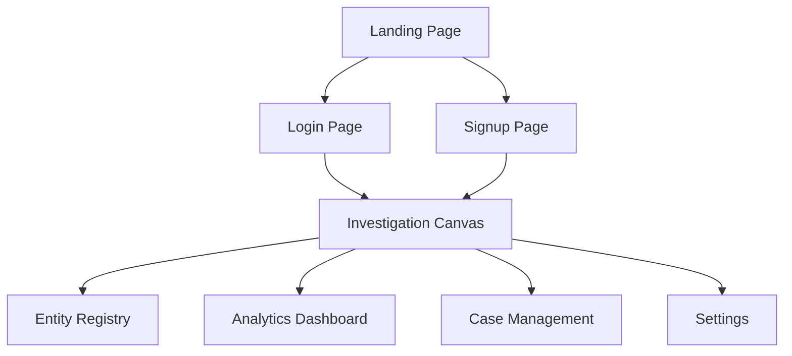

# 🕸️ Ravel - Forensic Audit & Relationship Mapping Platform

## Project Overview

Ravel is an internal forensic investigation and relationship-mapping platform built for financial intelligence teams and corporate auditors. Modern corporate fraud rarely happens in plain sight—it hides inside fragmented SQL tables, disconnected spreadsheets, and multi-layered approval chains.

Instead of forcing auditors to manually compare thousands of isolated database entries, Ravel unifies flat corporate records into an interactive, color-coded network graph. By combining automated pattern matching with human-in-the-loop link review, Ravel turns complex transactional data into clear visual evidence.

---

## Core Problem & Solution

### The Problem
Traditional auditing workflows rely on static spreadsheets and tabular record views. Fraudulent networks exploit these data silos through:
* **Hidden Affiliations:** Fake vendor accounts created using an approving employee's personal contact details, tax ID, or bank account.
* **Circular Invoicing Loops:** Funds approved and routed in closed loops (Entity A → Entity B → Entity C → Entity A) that look like routine, independent transfers in table format.
* **Duplicate Claims:** Multiple invoices submitted across separate departments referencing identical transactions or tax identifiers.

### The Solution
Ravel bridges relational database management and graph visual analytics without requiring complex graph database infrastructure. An automated backend rule-engine surfaces candidate links, allowing auditors to visually trace multi-hop connections, confirm high-risk ties, and expose fraud schemes at a glance.

---

## Webpage Architecture

Ravel is structured across eight specialized pages serving specific phases of the forensic workflow:

 * **Landing Page:** Platform overview presenting Ravel's value proposition and core 4-step forensic pipeline (Ingest → Suggestion → Approval → Analytics).
* **Login & Signup Pages:** Secure access control for auditing staff with role assignment (Auditor, Senior Auditor, Administrator).
* **Investigation Canvas:** The primary workspace featuring an interactive React Flow graph, system-suggested edge links, side-by-side link approval tools, and an entity node inspector.
* **Entity Registry:** Structured database view displaying Employees, Vendors, and Invoices with risk status badges and direct "View Graph" shortcuts.
* **Analytics Dashboard:** Algorithmic detection suite offering multi-hop pathfinding between two selected entities, automated circular loop detection, and risk-level distribution charts.
* **Case Management:** Ticket-style tracking workspace organizing related graph nodes, entities, and evidence into named cases (Open, Under Review, Closed).
* **Settings:** Administrative panel for role permissions, user preferences, and audit log retention configurations.

---

## Key Features

* **Interactive Relationship Canvas:** Visualizes employees, vendors, and invoices as interactive nodes connected by relationship lines.
* **Human-in-the-Loop Review:** System-suggested ties render as dashed lines; auditors click Approve or Reject in a side panel to convert them to solid confirmed lines or remove them.
* **Automated Cycle Detection:** Uncovers closed approval loops automatically through recursive path queries.
* **Multi-Hop Path Finder:** Selects any two entities across the network to expose hidden intermediate connections.
* **1:1 Strict Color Mapping:** Enforces consistent entity colors across all pages, tables, badges, and graph nodes.

---

## Centralized Design Tokens

All components import color values directly from `src/theme.js` to ensure visual consistency across every module:

* **Employees:** Blue (`#3B82F6`)
* **Vendors:** Green (`#10B981`)
* **Invoices:** Orange (`#F59E0B`)
* **Flagged / Shell Entities:** Red (`#EF4444`)
* **UI Highlights / Active Elements:** Cyan (`#06B6D4`)
* **Background Containers:** Slate Dark (`#1E293B`)

---

## Technical Stack

* **Frontend:** React, Vite, React Router
* **Graph Canvas Engine:** `@xyflow/react` (React Flow)
* **Styling & UI Tokens:** Centralized JavaScript Design Tokens (`src/theme.js`), Tailwind CSS
* **Icons:** Lucide React
* **Backend & Database:** Node.js, Express, MySQL (using Recursive CTEs for graph traversal)

---

## Future Enhancements

* **Real-time Edge Pulsing:** Automated visual highlighting along graph paths when circular cash flows are flagged.
* **Document Ingestion:** Automated invoice extraction pipeline converting raw PDFs into structured database records.
* **Probabilistic Link Prediction:** Machine learning integration to detect subtle implicit ties beyond exact tax/bank ID matches.