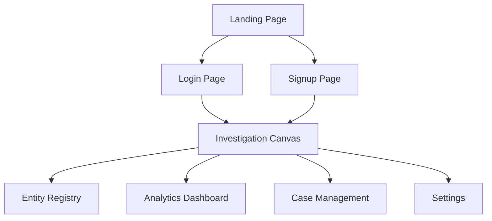

# 🕸️ Ravel - Forensic Audit & Relationship Mapping Platform

## Project Overview

Ravel is an internal forensic investigation and relationship-mapping platform built for financial intelligence teams and corporate auditors. Modern corporate fraud rarely happens in plain sight—it hides inside fragmented SQL tables, disconnected spreadsheets, and multi-layered approval chains.

Instead of forcing auditors to manually compare thousands of isolated database entries, Ravel unifies flat corporate records into an interactive, color-coded network graph. By combining automated pattern matching with human-in-the-loop link review, Ravel turns complex transactional data into clear visual evidence.

---

## Core Problem & Solution

### The Problem
Traditional auditing workflows rely on static spreadsheets and tabular record views. Fraudulent networks exploit these data silos through:
* **Hidden Affiliations:** Fake vendor accounts created using an approving employee's personal contact details, tax ID, or bank account.
* **Circular Invoicing Loops:** Funds approved and routed in closed loops (Entity A → Entity B → Entity C → Entity A) that look like routine, independent transfers in table format.
* **Duplicate Claims:** Multiple invoices submitted across separate departments referencing identical transactions or tax identifiers.

### The Solution
Ravel bridges relational database management and graph visual analytics without requiring complex graph database infrastructure. An automated backend rule-engine surfaces candidate links, allowing auditors to visually trace multi-hop connections, confirm high-risk ties, and expose fraud schemes at a glance.

---

## Webpage Architecture & Detailed Functionality

Ravel is structured across eight specialized pages serving specific phases of the forensic workflow:



### 1. Landing Page (`src/pages/Landing.jsx`)
* **Overview:** Public platform presentation highlighting Ravel's value proposition and core 4-step forensic pipeline (Ingest → Suggestion → Approval → Analytics).
* **Capabilities:** Feature presentation of key capabilities, core graph technology, and solution modules.
* **Navigation:** Direct navigation links to `/login` and `/signup` with in-page anchor scrolling for contact inquiries (`#contact-us`).

### 2. Login & Signup Pages (`src/pages/LoginPage.jsx`, `src/pages/SignupPage.jsx`)
* **Overview:** Access control interface for authentication and onboarding.
* **Capabilities:** Role assignment (Auditor, Senior Auditor, Administrator) and workspace entry redirection straight into the internal investigation suite upon authentication.

### 3. Investigation Canvas (`src/pages/InvestigationCanvas.jsx`)
* **Overview:** The core visual workspace driven by an interactive node-link graph environment.
* **Capabilities:**
  * **Interactive Graph Visualization:** Zoom, pan, drag, and expand entity nodes representing Employees, Vendors, and Invoices.
  * **Human-in-the-Loop Edge Review:** Review system-suggested connections (rendered as dashed lines). Approve or reject suggestions in real-time to convert them to solid verified links or discard them.
  * **Node Inspector:** Click any entity to inspect attached metadata (GST numbers, SSN/IDs, total transaction volume, risk scores).
  * **Add Entity Modal:** Dynamically inject new entities and candidate connections into the graph engine.
  * **State Persistence:** Local storage sync automatically retains graph node/edge states across sessions (`ravel_nodes`, `ravel_edges`).

### 4. Entity Registry (`src/pages/EntityRegistry.jsx`)
* **Overview:** A master tabular repository indexing all system entities across Employees, Vendors, and Invoices.
* **Capabilities:**
  * Multi-attribute search and category filtering.
  * Quick-action **"View Graph"** buttons that jump directly to the Canvas with target node IDs highlighted.
  * Detailed modal popups displaying raw identifier fields (GST, Bank Account No., Phone, Address).

### 5. Analytics Dashboard (`src/pages/Analytics.jsx`)
* **Overview:** Algorithmic detection and intelligence suite for deep network analysis.
* **Capabilities:**
  * **Multi-Hop Path Finder:** Select any two entities across the network to automatically calculate and highlight the shortest connection path.
  * **Circular Loop Detection:** Algorithmic detection of recursive funding loops (CTE path queries) exposing entity round-tripping.
  * **Visual Metrics:** Recharts integration displaying Risk Level distributions, Anomaly Counts, and Entity Type breakdowns.

### 6. Case Management Workspace (`src/pages/CaseManagement.jsx`)
* **Overview:** Ticket-style tracking workspace organizing related graph nodes, entities, and evidence into named investigation cases.
* **Capabilities:**
  * Case state management (`Open`, `Under Review`, `Closed`) with severity indicators (`High`, `Medium`, `Low`).
  * Filter cases by Type (`Procurement Fraud`, `Conflict of Interest`, `Insider Trading`), Risk, and Date ranges.
  * **Case Inspector Drawer:** Slide-out drawer displaying linked core entities, identifier feeds, and flagged risk logs.
  * Statistical summary cards tracking total open cases, flagged case feeds, and audit activity logs.

### 7. Platform Settings (`src/pages/Settings.jsx`)
* **Overview:** Administrative panel for workspace configuration, display customizer, and rule sensitivity management.
* **Capabilities:**
  * **User Profile & Access Control:** Profile edits and modal-driven password update validation.
  * **Platform Display Controls:** Dark/Light mode toggle, dynamic font-size adjustment slider (14px – 24px), and primary accent color picker.
  * **Analytical Rule Engine Management:** Interactive slider adjustments for sensitivity thresholds on GST Match, Circular Loop Detection, Fuzzy Name Matching, and Timeline Gaps.
  * **Audit Trail & System Logs:** Paginated view of system configuration logs, recent rule edits, and performance overviews.

---

## Key Features

* **Interactive Relationship Canvas:** Visualizes employees, vendors, and invoices as interactive nodes connected by relationship lines.
* **Human-in-the-Loop Review:** System-suggested ties render as dashed lines; auditors click Approve or Reject in a side panel to convert them to solid confirmed lines or remove them.
* **Automated Cycle Detection:** Uncovers closed approval loops automatically through recursive path queries.
* **Multi-Hop Path Finder:** Selects any two entities across the network to expose hidden intermediate connections.
* **1:1 Strict Color Mapping:** Enforces consistent entity colors across all pages, tables, badges, and graph nodes.

---

## Technical Stack & Libraries Used

### Frontend & UI Libraries
* **React 18**: Core component UI framework.
* **React Router DOM (`react-router-dom`)**: Declarative client-side routing and view switching (`/canvas`, `/registry`, `/analytics`, `/cases`, `/settings`).
* **React Flow (`@xyflow/react`)**: High-performance node-based graph rendering engine for the Investigation Canvas.
* **Recharts (`recharts`)**: Data visualization library powering charts, bar graphs, and distribution metrics on the Analytics Dashboard.
* **Lucide React (`lucide-react`)**: Modern icon suite used across navigation, status badges, buttons, and drawers (`Search`, `ShieldAlert`, `Plus`, `Edit2`, `UserPlus`, etc.).
* **Tailwind CSS**: Utility-first CSS framework for styling layouts, grids, flexboxes, and dynamic theme applications.

### Backend & Database (Planned)
* **Backend Framework:** Node.js, Express
* **Database:** MySQL, Neo4j (Neo4j evaluated as a future benchmarking target for graph-traversal performance at scale, per the Relational SQL vs. Neo4j roadmap item)

### AI Integration

Ravel's rule-engine is augmented by a real AI layer (`src/services/aiService.js`), powered by **Google Gemini** (`gemini-2.5-flash` via `@google/genai`), with an automatic rule-based fallback whenever no API key is configured or a call fails — so every feature below works with or without a live model connection. It's actively used on both the **Investigation Canvas** and **Analytics** pages:

* **Hidden Link Discovery (Investigation Canvas):** Scans all graph entities to propose unlinked relationships (GST matches, transaction-sender/employee correlation, vendor-invoice name matches) beyond simple exact-field checks.
* **Node Risk Analysis (Investigation Canvas):** Classifies an entity's risk tier (Low / Medium / Critical) with a generated auditor summary and policy-violation flags.
* **Multi-Hop Path Explanation (Analytics):** Produces a concise executive summary of why a discovered entity chain represents audit risk.
* **Spend Outlier Explanation (Analytics):** Explains in plain language why a specific financial data point breached standard-deviation thresholds.
* **Anomaly Feed Summarization (Analytics):** Converts raw flagged nodes into readable, prioritized anomaly alert cards.
* **Circular Reference Detection Narratives (Analytics):** Adds human-readable descriptions to algorithmically detected approval/payment loops.

### Architecture & Data Management
* **Vite**: Frontend build tool and development server.
* **Centralized Design Tokens (`src/theme.js`)**: Single source of truth for entity color mapping and platform styling.
* **Browser Storage Persistence (`localStorage`)**: Client-side fallback storage engine keeping custom graph nodes, edges, and case edits persistent across browser refreshes.

---

## Mock Data Architecture (`src/data/mockData.js`)

Ravel relies on a relational, graph-compatible mock dataset (`mockData.js`) that simulates enterprise SQL dumps:

**Nodes Structure (`initialNodes`):**

```javascript
{
  id: 'emp-001',
  type: 'entityNode',
  position: { x: 250, y: 150 },
  data: {
    label: 'B. Patel',
    type: 'Employee', // Employee | Vendor | Invoice
    role: 'Senior Procurement Lead',
    gst: '07AABCB1234H1Z5',
    status: 'Flagged',
    riskScore: 85
  }
}
```

**Edges Structure (`initialEdges`):**

```javascript
{
  id: 'edge-001',
  source: 'emp-001',
  target: 'ven-004',
  type: 'edgeBadge',
  data: {
    isSuggested: true, // true = Dashed line (Needs Review), false = Solid line (Approved)
    label: 'Shared GST & Phone ID'
  }
}
```

---

## Centralized Design Tokens (`src/theme.js`)

All components import color values directly from `src/theme.js` to ensure visual consistency across every module:

* **Employees:** Blue (`#3B82F6`)
* **Vendors:** Green (`#10B981`)
* **Invoices:** Orange (`#F59E0B`)
* **Flagged / Shell Entities:** Red (`#EF4444`)
* **UI Highlights / Active Elements:** Cyan (`#06B6D4`)
* **Background Containers:** Slate Dark (`#1E293B`)

---

## Installation & Setup

**Clone the Repository:**

```bash
git clone https://github.com/your-username/ravel-audit-platform.git
cd ravel-audit-platform
```

**Install Dependencies:**

```bash
npm install
```

**Start Development Server:**

```bash
npm run dev
```

**Build for Production:**

```bash
npm run build
```

---

## Future Enhancements

* **Automated Document Ingestion:** OCR and LLM pipeline to automatically parse PDF invoices and ingest entities into the registry.
* **Real-time Edge Pulsing Animation:** Visual path highlighting along graph lines when circular cash flows or CTE loops trigger high-risk alerts.
* **OSMR & Geospatial Routing:** Integration of Open Source Routing Machine to calculate physical travel distances and highlight impossible vendor-to-employee supply logistics.
* **Multi-Industry Modular Engines:** Domain-specific analytical modules tailored to detect healthcare billing rings, supply chain invoice padding, and public grant diversion.
* **Real-Time ERP Streaming Pipeline:** Apache Kafka event-stream integration pushing immediate transaction holds directly into live enterprise ERP systems like SAP.
* **Distributed Graph Engine Scaling:** Architecture migration to high-throughput graph databases (Neo4j/AWS Neptune) for low-latency CTE recursive path processing at scale.
* **Automated Executive Audit Reporting:** One-click generation of court-ready PDF forensic documentation featuring embedded graph snapshots and verified AI evidence chains.